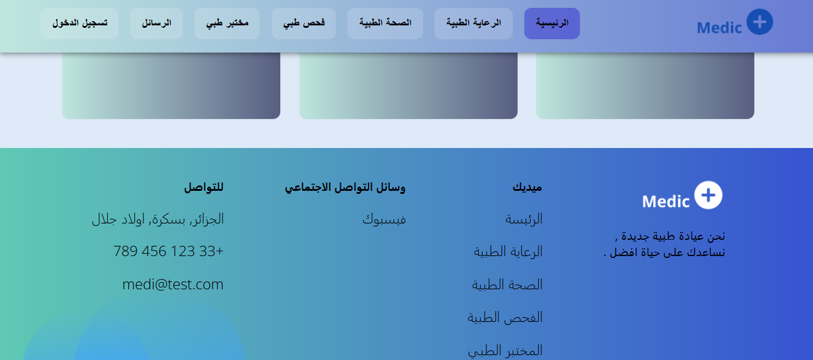

A beautiful hospital landing page built with React JS

## 📸 صور من الموقع
واجهة موقع احترافية لتقديم الخدمات الطبية بشكل أنيق ومبسط باستخدام React و Firebase.

### 🩺 قسم الخدمات (Services)

### 👨‍⚕️ قسم الأطباء (Doctors)

### 🏥 قسم المرافق (Facilities)

### 💬 قسم طلب الرأي الطبي (Opinion)

### 🔚 قسم التذييل (Footer)

(https://github.com/ikrame450/hospital-landing)
